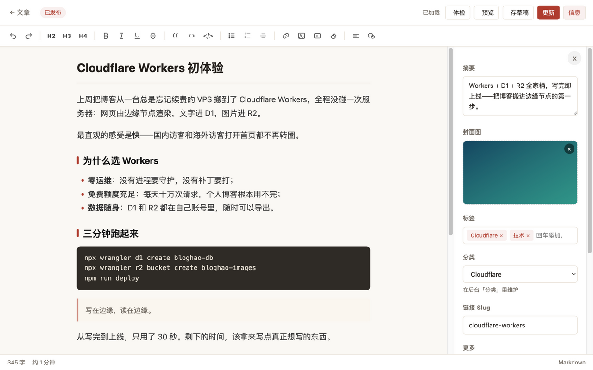
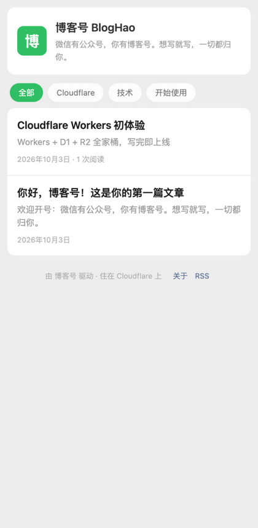

<div align="center">


# 博客号 BlogHao

**微信有公众号，你有博客号。** 轻松开号，认真写字 · 公众号风格 · 免费部署 · MIT 开源

[官网](https://bloghao-site.0471666.workers.dev) ·
[在线示例](https://bloghao.0471666.workers.dev) ·
[五分钟部署](#-五分钟部署) ·
[文档](#-文档)

   

</div>

---

博客号（BlogHao）是一套**完全运行在 Cloudflare** 上的博客系统：网页由 Workers 边缘渲染，文字存进 D1，图片传进 R2 —— 服务器、运维、账单，统统不存在。写作后台对标微信公众号编辑器，截图 `⌘V` 粘贴即自动上云，发布前还能按《微信公众平台编辑器插件开发规范》给文章做一次「排版体检」。

> **博客号，博客好。** 微信有公众号，你有博客号——不用申请、不用排队，注册账号的那一刻它就归你了。

| 🖋️ 写作后台 | 📱 手机上的阅读端 |
| --- | --- |
|  |  |

## 为什么是博客号

- **微信有公众号，你有博客号**：名字就是态度——每个人都能轻松拥有一个自己的号
- **零成本起步**：Workers / D1 / R2 免费额度对个人博客是天文数字，不用绑卡也能跑
- **写作体验优先**：像发动态一样轻地写，像写文章一样认真地排
- **数据 100% 归你**：库是你自己的 D1，图是你自己的 R2，代码在你自己的 GitHub
- **没有任何框架枷锁**：后端约 10 个 TS 文件 + 原生 JS 后台，无构建链，二次开发零门槛

## ✨ 特性一览

| | |
| --- | --- |
| ✍️ **公众号风写作后台** | 富文本工具栏 / Markdown 模式互转 / 粘贴与拖拽自动上传 / 自动保存 / 一键预览 |
| 🩺 **排版体检** | 按微信官方规范静态检查 13 条规则（固定宽度、行高叠字、`!important`、嵌套层级、`data-w`…），支持一键修复 |
| 🎨 **四套主题** | 微信公众号（明亮）/ 纸墨 / 极简 / 夜航，后台即点即换；主题即模块，开放注册 |
| 🧩 **编辑器插件** | `window.BlogHao.registerPlugin({...})`，一个 JS 文件扩展编辑器，无需构建 |
| 🖼️ **R2 图床** | 图片视频私有存储，Worker 鉴权输出 + 长缓存 + ETag 304，媒体库可视化管理 |
| 🔒 **安全默认开启** | PBKDF2 / HttpOnly 会话 / CSRF 同源校验 / HTML 白名单净化 / 评论蜜罐限流 / CSP |
| ⚡ **快** | SSR 直出、主题 CSS 内联零额外请求、边缘节点全球分发 |
| 📡 **自带生态件** | RSS、sitemap、robots.txt、OG 分享标签、GitHub Actions 自动部署 |

<details>
<summary><b>📖 查看全部特性细节</b></summary>

- **文章**：草稿 / 发布 / 置顶 / 自定义 slug / 标签 / 摘要 / 封面 / 阅读量与点赞
- **评论**：站点级开关、先审后展、后台管理
- **媒体库**：网格预览、复制地址、删除，统计占用
- **账号**：首次进入后台即创建管理员，后台可改密码
- **可定制**：站点名称 / 描述 / 页脚 / 每页文章数 / 关于页富文本
- **规范属性透传**：`data-w`、`data-ignore-width`、`data-no-dark`、`data-ignore-dm` 原样保留

</details>

## 🚀 五分钟部署

> 前置：Node.js 18+、一个 Cloudflare 账号。完整版教程（含自定义域名、备份、FAQ）见 [docs/DEPLOY.md](docs/DEPLOY.md)。

```bash
# 1. 克隆并安装
git clone https://github.com/lovexw/bloghao.git
cd bloghao && npm install
npx wrangler login

# 2. 创建资源
npx wrangler d1 create bloghao-db            # 把返回的 database_id 填进 wrangler.jsonc
npx wrangler r2 bucket create bloghao-images

# 3. 初始化数据库（幂等，可重复执行）
npx wrangler d1 execute DB --remote --file schema.sql

# 4. 部署
npm run deploy
```

打开 `https://bloghao.<你的子域>.workers.dev/admin/`，**首次进入即创建管理员**，欢迎文章已就位，删掉它开始写你自己的第一篇吧。

<details>
<summary><b>推上 GitHub，开启 push 自动部署</b></summary>

```bash
git remote add origin git@github.com:<你>/bloghao.git
git push -u origin main
```

在仓库 Settings → Secrets → Actions 添加 `CLOUDFLARE_API_TOKEN`（Workers Scripts + D1 + R2 编辑权限）与 `CLOUDFLARE_ACCOUNT_ID`，仓库内置的 `.github/workflows/deploy.yml` 会在每次 push 到 `main` 时自动执行：类型检查 → 同步 schema → 部署。官网（`website/` 目录）有独立的自动部署 workflow。

</details>

## 🧑‍💻 本地开发

```bash
npm install
npm run db:init:local   # 初始化本地 D1（.wrangler/state，与线上互不影响）
npm run dev             # http://127.0.0.1:8787
npm run typecheck       # TypeScript 类型检查
```

## 📦 目录结构

```
bloghao/
├── src/                # Cloudflare Worker（后端 + SSR + 主题）
│   ├── index.ts        # 入口与路由
│   ├── api.ts          # 全部 JSON API
│   ├── pages.ts        # 公开页 SSR
│   ├── auth.ts / sanitize.ts / markdown.ts / db.ts / render.ts / rss.ts
│   └── themes/         # 四套主题 + 注册表（新主题加在这里）
├── public/
│   ├── admin/          # 管理后台 SPA（原生 JS，无构建）
│   └── plugins/        # 编辑器插件目录
├── website/            # 本官网（独立部署：cd website && wrangler deploy）
├── docs/               # 全部文档
└── schema.sql          # D1 表结构（幂等）
```

## 📚 文档

| 文档 | 内容 |
| --- | --- |
| [docs/DEPLOY.md](docs/DEPLOY.md) | **部署教程**：资源创建、首次上线、自定义域名、GitHub 自动部署、备份恢复、FAQ |
| [docs/GUIDE.md](docs/GUIDE.md) | **使用手册**：后台导览、写文章全流程、快捷键、评论与媒体管理、设置逐项说明 |
| [docs/THEMES.md](docs/THEMES.md) | 主题开发指南：三步注册一套新主题 |
| [docs/PLUGINS.md](docs/PLUGINS.md) | 插件开发指南：编辑器插件 API 与加载机制 |
| [docs/API.md](docs/API.md) | API 参考：全部公开 / 管理接口 |
| [docs/wechat-typography-spec.md](docs/wechat-typography-spec.md) | 微信排版规范落地对照 + 体检规则表 |

## ❓ FAQ

<details>
<summary><b>workers.dev 域名访问慢或不通？</b></summary>

绑定你自己的域名：Cloudflare 面板 → Workers & Pages → bloghao → Domains & Routes → Add Custom domain。绑定后把「设置 → 站点链接」改成新域名（影响 RSS / sitemap 绝对链接）。
</details>

<details>
<summary><b>忘记管理员密码？</b></summary>

```bash
npx wrangler d1 execute DB --remote --command "DELETE FROM users; DELETE FROM sessions;"
```

然后重新访问 `/admin/` 创建账号，文章 / 评论 / 图片全部保留。
</details>

<details>
<summary><b>会一直免费吗？</b></summary>

Cloudflare 免费套餐：Workers 每天十万次请求、D1 五百万行读、R2 10GB 存储 —— 对个人博客是几个月到几年的量。用超了再考虑 $5/月的付费计划，代码无需任何改动。
</details>

<details>
<summary><b>如何升级到最新版？</b></summary>

```bash
git pull
npm install
npm run deploy     # schema 有更新时再执行一次 db:init:remote（幂等）
```
</details>

## 🛣 路线图

- [ ] 多作者协作
- [ ] 评论回复（楼中楼）
- [ ] 编辑器 Markdown 快捷输入（`> ` 自动转引用等）
- [ ] 服务端插件钩子（发布 / 评论事件回调）
- [ ] 主题市场：独立主题仓库一键安装
- [ ] 图片压缩与 WebP 自动转换

欢迎通过 Issue 提需求，通过 PR 贡献代码 —— 主题、插件、文档翻译都是很好的起点。

## 🤝 参与贡献

1. Fork → 新建分支（`git checkout -b feat/xxx`）
2. `npm run typecheck` 保持绿色
3. 提交 PR，描述清楚「改了什么、为什么」

> 小改动（错别字、样式微调）直接 PR，不用开 Issue。

## 📄 License

[MIT](LICENSE) —— 拿去用，拿去改，拿去让更多人爱上写博客。
